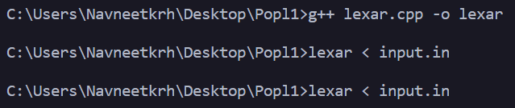

#lexical analyzer in c++ developed by Navneet kumar and Het Dave
# Please use command promt(not powershell) to compile and run the code(Windows)

## To run the code
Compile using:
```
g++ lexar.cpp -o lexar
```
Run normally:
```
./lexar
```
Run by redirecting input via buffer:

```
./lexar < input.in
```

just like the image above

## To view the final output on terminal
To view all tokens present in program:
```
cat pa_1.out
```

To view Symbol table which contains only unique tokens(keywords and identifier only):
```
cat symbol_table_1.out
```


## Features
1. Lexar class contains all the functions to remove comments, tokenize the program, and generate symbol table.
2. to use the class make an object of Lexar class and call the function lexar.init() to start initializing the values.
3. Detects all type of `operators` including ++, --, +=, etc..
4. `symbol_table_1.out` contains the symbol table of keywords and identifier(distinct):
	* mainted a set to implement this mehtodology
5. Utilized `fstream` and `fopen` for file handling

## Assumptions
1. `Max size` of code is set to `5000` characters.
2.single line comments start with `//` and multiline comments start with `/*` and end with `*/`.just like c++.


